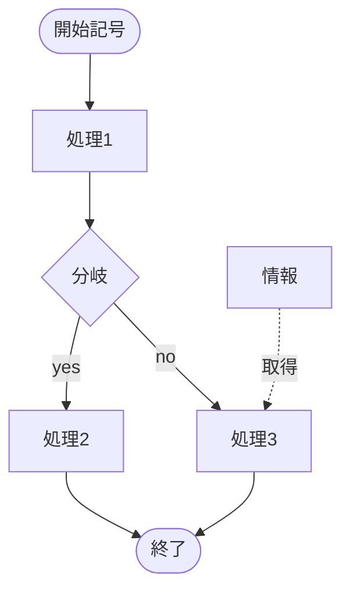

テキストでフローチャートなどを表現できるJSのライブラリ、以下はサンプル。

```mermaid
flowchart TD
    %% コメント
    start([開始記号])
    method1[処理1]
    if{分岐}
    method2[処理2]
    method3[処理3]
    info[情報]
    finish([終了])

    start --> method1
    method1 --> if
    if -->|yes| method2
    if -->|no| method3
    info -.->|取得| method3
    method2 --> finish
    method3 --> finish
```

